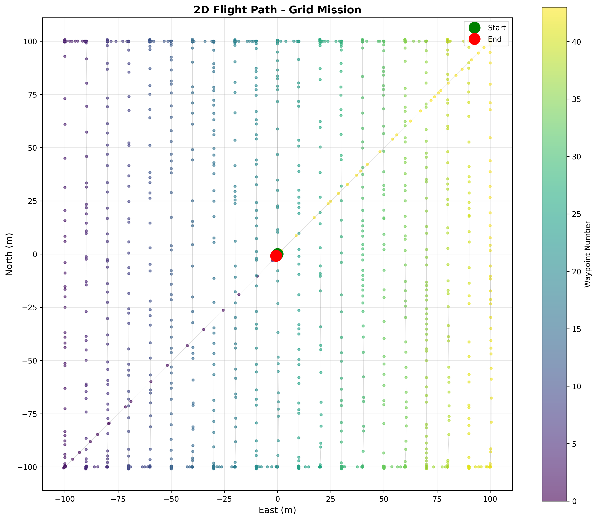
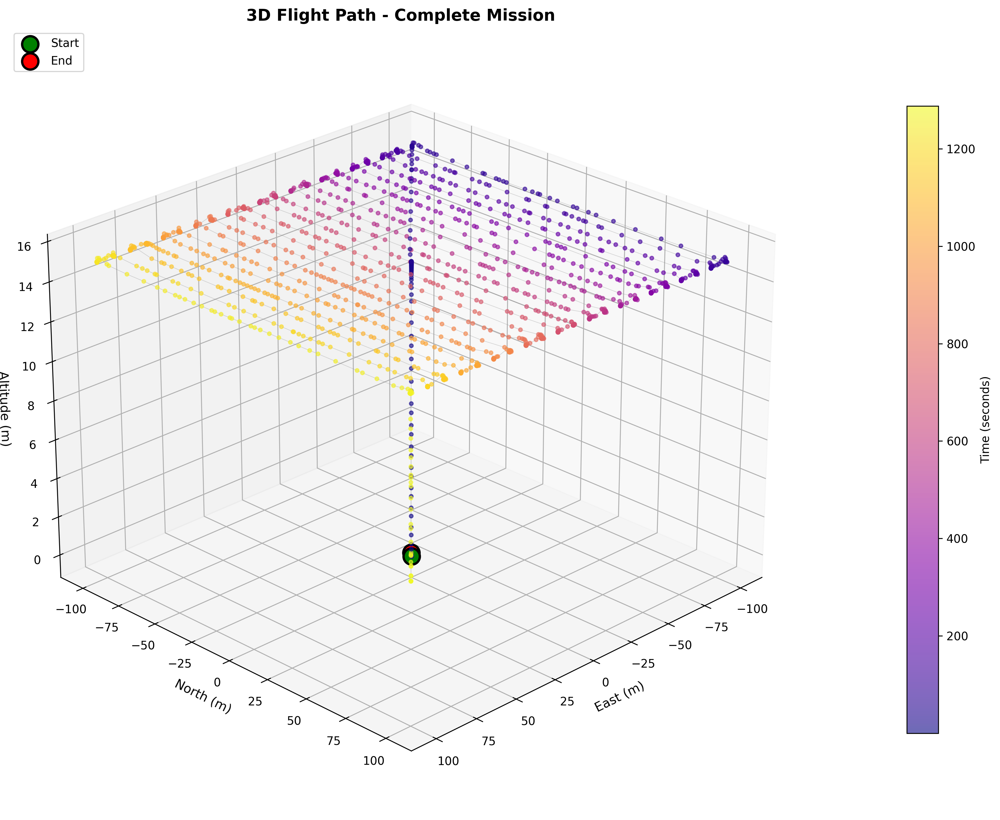
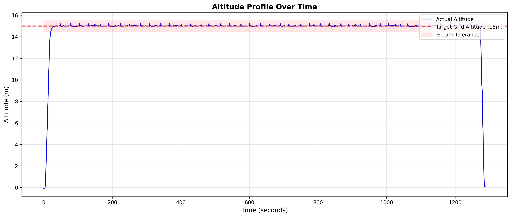
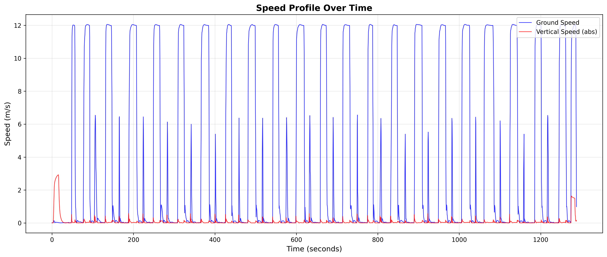

# UAV Development

A hands-on learning project for UAV (Unmanned Aerial Vehicle) development using industry-standard open-source tools. Starting from simulation and progressing toward real hardware implementation.

## 🎯 Project Goals

- Master UAV fundamentals through simulation-first approach
- Build proficiency with PX4, Gazebo, and MAVLink protocol
- Develop autonomous flight algorithms and mission planning
- Progress from simulation to real Pixhawk hardware (Holybro X500 V2)

## 🛠️ Development Environment

**Current Setup:**
- MacBook Pro M3 Pro, 36GB RAM, macOS Sequoia 15.3
- PX4 Autopilot v1.17.0alpha
- Gazebo Harmonic (gz-sim8)
- QGroundControl

**Target Hardware:**
- Holybro X500 V2 Kit with Pixhawk 6C (~£600)
- UK CAA registration required (>250g)

## 🚀 Quick Start

### Running the Simulation
```bash
# Terminal 1 - Launch PX4 + Gazebo
cd ~/dev/uav_dev/PX4-Autopilot
source px4_venv/bin/activate
make px4_sitl gz_x500

# Terminal 2 - Run autonomous grid mission
cd ~/dev/uav_dev/scripts/missions
python3 grid_flight.py
```

### Visualize Flight Data
```bash
cd ~/dev/uav_dev/scripts/analysis
python3 visualize_flight.py
```

## ✅ Achievements

**Week 1 (November 2025):**
- ✅ Complete PX4 development environment on macOS M3
- ✅ First autonomous flight in simulation
- ✅ Basic MAVLink communication and OFFBOARD mode

**Week 2 (March 2026):**
- ✅ Position monitoring and waypoint navigation
- ✅ Multi-waypoint missions with 0.5m accuracy
- ✅ Grid pattern generator for systematic area coverage
- ✅ Boustrophedon (lawn mower) flight algorithm
- ✅ Real-time telemetry logging (2 Hz)
- ✅ Professional flight data visualization

### Recent Mission Results

**200m × 200m Grid Inspection:**
- **Duration**: 21.5 minutes
- **Distance**: 4.75 km
- **Coverage**: 40,000 m² (4 hectares)
- **Waypoints**: 44 (42 grid + takeoff + landing)
- **Altitude accuracy**: ±0.24m from 15m target
- **Telemetry readings**: 2,528

## 📊 Flight Visualization Examples

### 2D Flight Path - Complete Coverage

*Systematic grid pattern with 21 parallel tracks covering entire inspection area*

### 3D Mission Profile

*Complete mission trajectory showing takeoff, grid execution at constant altitude, and landing*

### Altitude Consistency

*Maintained 15m altitude within ±0.5m tolerance throughout 21-minute grid mission*

### Speed Optimization

*Efficient acceleration/deceleration pattern - 21 cycles corresponding to grid tracks*

## 🗺️ Learning Roadmap

### Phase 1: Simulation Fundamentals ✅ (Complete)
- [x] Set up PX4 + Gazebo + QGroundControl
- [x] Autonomous position control in OFFBOARD mode
- [x] Multi-waypoint mission execution
- [x] Grid pattern generation and execution
- [x] Telemetry logging and visualization

### Phase 2: Advanced Capabilities (Next)
- [ ] Camera integration and triggering
- [ ] Computer vision for damage detection
- [ ] Real-time mission planning
- [ ] Velocity-based trajectory following
- [ ] ROS 2 integration

### Phase 3: Hardware Deployment
- [ ] Holybro X500 V2 assembly
- [ ] UK CAA operator registration
- [ ] Hardware-in-the-loop (HITL) testing
- [ ] Outdoor flight testing

## 🎓 Key Concepts Mastered

- **MAVLink Protocol**: OFFBOARD mode, position setpoints, type masks
- **Grid Patterns**: Boustrophedon algorithm for efficient area coverage
- **NED Coordinates**: North-East-Down frame navigation
- **Telemetry Logging**: CSV-based flight data recording at 2 Hz
- **Data Visualization**: matplotlib for professional flight analysis
- **Threading**: Background setpoint streaming and telemetry capture

## 📁 Project Structure
```
uav_dev/
├── PX4-Autopilot/          # PX4 flight stack
├── scripts/
│   ├── missions/
│   │   ├── first_flight.py      # Basic autonomous flight
│   │   ├── grid_mission.py      # Grid pattern generator
│   │   ├── grid_flight.py       # Full grid mission execution
│   │   ├── telemetry_logging.py # Flight data recorder
│   │   └── logs/                # Flight telemetry CSVs
│   └── analysis/
│       ├── visualize_flight.py  # Plot generation
│       └── plots/               # Generated visualizations
└── README.md
```

## ⚠️ Important Notes

### macOS M3 Build Modifications

**CMakeLists.txt:**
```cmake
set(CMAKE_CXX_STANDARD 17)  # Changed from 14
```

**cmake/px4_add_common_flags.cmake:**
```cmake
-Wno-double-promotion  # Changed from -Wdouble-promotion
```

### MAVLink Ports
- **14540**: Autonomous scripts (onboard computer)
- **14550**: QGroundControl (ground station)

## 🤝 Resources

- [PX4 Documentation](https://docs.px4.io/)
- [MAVLink Protocol](https://mavlink.io/en/)
- [PX4 Discuss Forum](https://discuss.px4.io/)

## 📄 License

MIT License

---

**Status**: 🟢 Active Development  
**Last Updated**: March 12, 2026

*"From theory to autonomous grid missions in 3 months."*